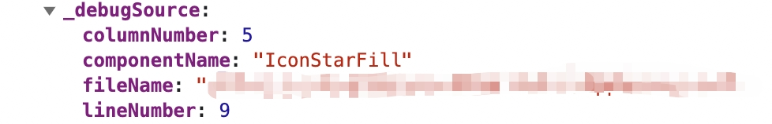

## babel-react-component-sources
add some source into react dom node , work with react-location



## use
```
yarn install babel-plugin-react-component-sources
```
```
.babelrc:

{"plugins":["babel-plugin-react-component-sources"]}
```

